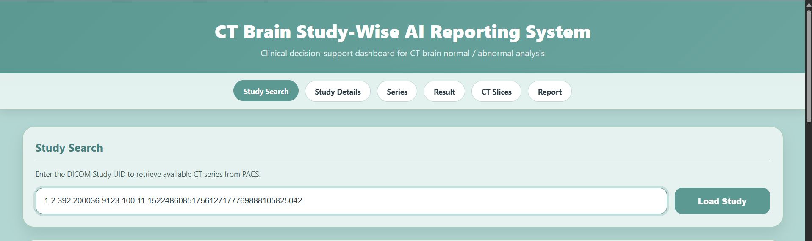
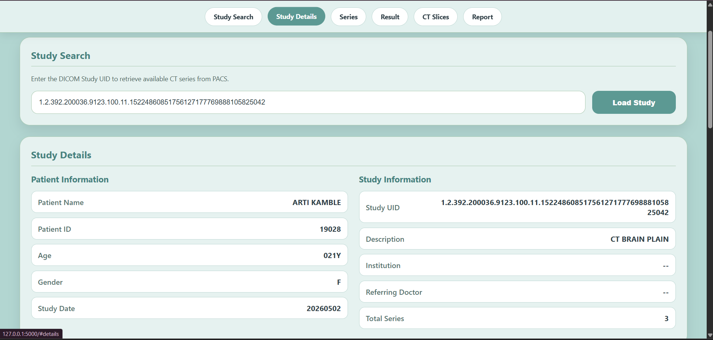
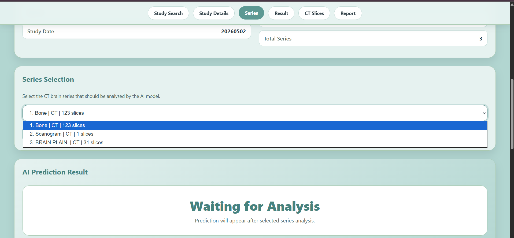
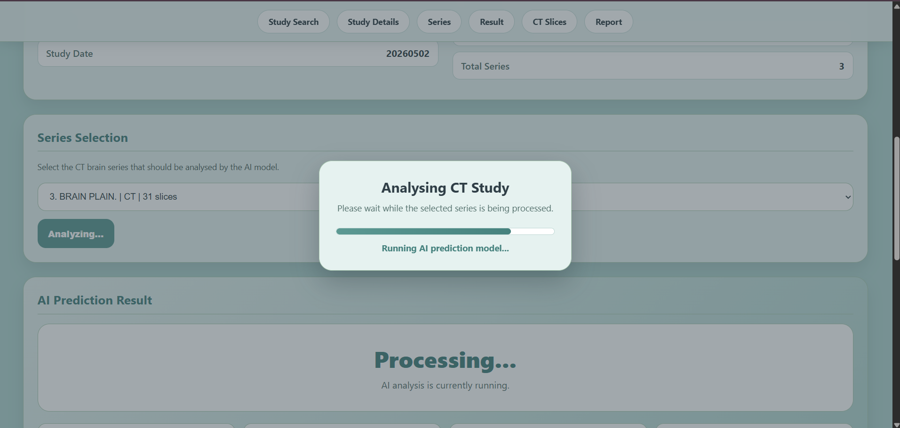
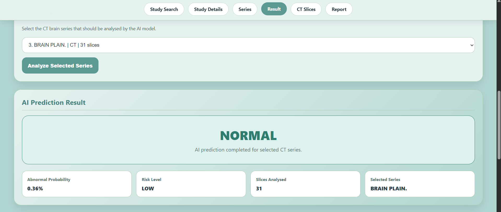
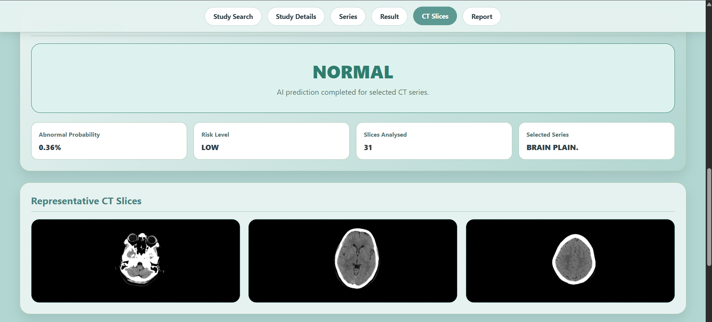
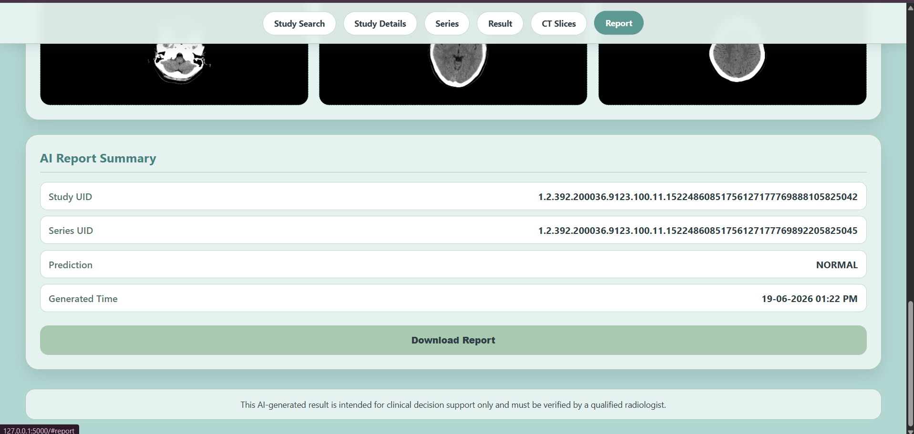

<div align="center">

# 🧠 CT Brain Study-Wise AI Reporting System

### AI-Powered Clinical Decision Support Dashboard for Automated CT Brain Analysis

<p align="center">


</p>

Study-wise CT Brain abnormality detection using **ConvNeXt Tiny**, **Attention-based Multiple Instance Learning (MIL)**, **TensorFlow**, **Flask**, and **DICOMWeb** integration.

</div>

---

# 📖 Overview

Radiologists often review hundreds of CT slices for a single patient study. This project provides an AI-assisted clinical decision support system that automatically retrieves CT Brain studies from a PACS server, analyzes them using Deep Learning, and generates a study-wise prediction with representative CT slices and an AI report.

Instead of classifying individual slices, the model predicts the **entire CT study** as:

- ✅ Normal
- ⚠️ Abnormal

This study-wise approach better reflects real-world clinical workflows.

---

# ✨ Key Features

- 🔍 Search CT studies using DICOM Study UID
- 🏥 PACS integration using DICOMWeb
- 👤 Automatic patient & study metadata retrieval
- 📚 CT series selection
- 🧠 AI-powered study-wise prediction
- 📊 Abnormal probability estimation
- ⚠️ Risk level assessment
- 🖼 Representative CT slice visualization
- 📄 AI report generation
- 📥 Downloadable prediction report
- ⚡ Modern responsive Flask interface

---

# 🏗️ System Architecture

```text
                    PACS Server
                         │
                         ▼
                  DICOMWeb Client
                         │
                         ▼
                 Retrieve CT Study
                         │
                         ▼
                DICOM Preprocessing
                         │
                         ▼
          ConvNeXt Tiny Feature Extractor
                         │
                         ▼
       Attention-based Multiple Instance Learning
                         │
                         ▼
                Study-wise Prediction
                         │
            ┌────────────┼────────────┐
            ▼            ▼            ▼
      Risk Score   CT Slice Preview   AI Report
```

---

# 🔄 Application Workflow

```text
Study UID
      │
      ▼
Load Study
      │
      ▼
Retrieve Patient Information
      │
      ▼
Select CT Series
      │
      ▼
Analyze Selected Series
      │
      ▼
ConvNeXt Tiny Feature Extraction
      │
      ▼
Attention MIL Classification
      │
      ▼
Normal / Abnormal Prediction
      │
      ▼
Representative CT Slices
      │
      ▼
Generate AI Report
```

---

# 📸 Application Screenshots

## 🏠 Home



---

## 👤 Study Details



---

## 📚 Series Selection



---

## ⏳ AI Processing



---

## 🧠 Prediction Result



---

## 🖼 Representative CT Slices



---

## 📄 AI Report



---

# 🤖 AI Model

### Feature Extraction

- ConvNeXt Tiny

### Classification

- Attention-based Multiple Instance Learning (MIL)

### Framework

- TensorFlow
- Keras

### Decision Threshold

**0.15**

The threshold was experimentally selected to improve sensitivity toward abnormal CT studies.

---

# 📊 Model Performance

| Metric | Score |
|---------|-------|
| 🎯 Accuracy | **76.55%** |
| 🎯 Precision | **65.21%** |
| 🎯 Recall | **93.06%** |
| 🎯 F1 Score | **76.68%** |
| 🎯 ROC-AUC | **91.27%** |

### Confusion Matrix

| | Predicted Abnormal | Predicted Normal |
|----|-----------------|----------------|
| Actual Abnormal | 264 | 143 |
| Actual Normal | 20 | 268 |

---

# 💻 Technologies Used

### Backend

- Python
- Flask
- TensorFlow
- Keras
- NumPy
- OpenCV
- pydicom
- DICOMWeb Client

### Frontend

- HTML5
- CSS3
- JavaScript

### AI

- ConvNeXt Tiny
- Attention MIL

---

# 📂 Project Structure

```text
CT-Brain-StudyWise-AI-Reporting-System
│
├── app.py
├── metadata/
├── models/
├── scripts/
├── static/
│   ├── css/
│   └── js/
├── templates/
├── images/
└── README.md
```

---

# 🚀 Installation

```bash
git clone https://github.com/sheryl-15/CT-Brain-StudyWise-AI-Reporting-System.git

cd CT-Brain-StudyWise-AI-Reporting-System

python -m venv venv

venv\Scripts\activate

pip install -r requirements.txt

python app.py
```

---

# 📌 Future Improvements

- Multi-class disease classification
- Explainable AI (Grad-CAM)
- PDF report generation
- Docker deployment
- Cloud deployment
- User authentication
- PACS write-back support

---

# 👩‍💻 Author

**Sheryl Peacelin**

🎓 M.Sc. Artificial Intelligence & Data Science

Karunya Institute of Technology and Sciences

🔗 GitHub: https://github.com/sheryl-15

---

<div align="center">

## ⭐ If you found this project useful, consider giving it a star.

</div>